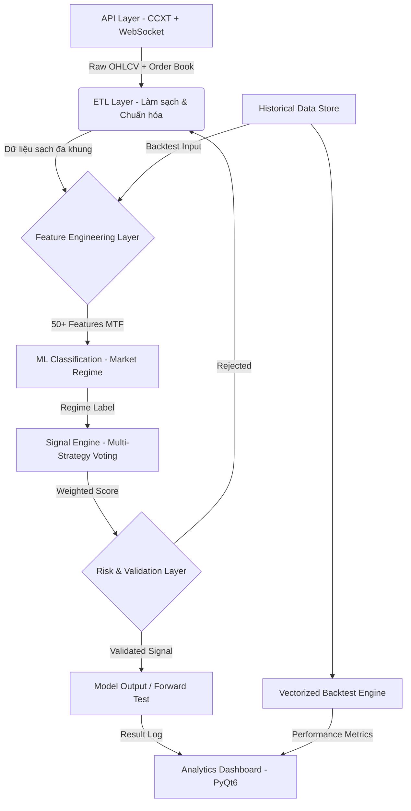

<div align="center">
 


# KAIROS QUANT SYSTEM
### **End-to-End Data Analytics Pipeline for Financial Market Research**

[](https://www.python.org/)
[](https://www.binance.com/)
[](https://opensource.org/licenses/MIT)

`Python` • `Pandas` • `Polars` • `Scikit-Learn` • `PyTorch` • `ETL Pipeline` • `Time-Series` • `Feature Engineering`

</div>

<div align="left">
 
-----

### Điểm nổi bật về kỹ năng Phân tích Dữ liệu (Data Skills Highlights)

* **Thiết kế ETL Pipeline tự động:** Thu thập, làm sạch và chuẩn hóa dữ liệu đa nguồn (**Binance, OKX, Bybit**) theo thời gian thực lẫn lịch sử — quy trình hoàn toàn tự động từ Raw API → Clean Dataset.
* **Feature Engineering trên Time-Series quy mô lớn:** Trích xuất 50+ đặc trưng (RSI, ATR, EMA, Bollinger Bands, Volume Profile, Fractal, CVD...) trên 8 khung thời gian đồng thời (**1m–1d**) với kỹ thuật tránh look-ahead bias nghiêm ngặt.
* **Xử lý dữ liệu hiệu suất cao:** Ứng dụng **vectorization** với Pandas/Polars để xử lý hàng triệu dòng dữ liệu, tăng tốc **100x+** so với vòng lặp tuần tự — thực tiễn trực tiếp cho bài toán dữ liệu quy mô lớn.
* **Xây dựng ML Pipeline hoàn chỉnh:** Từ feature extraction, labeling, training (**PyTorch TradingMLP**) đến validation và deployment — phân loại trạng thái thị trường thành 6 nhóm với confidence scoring.
* **Backtesting như Hypothesis Testing:** Thiết kế framework kiểm định giả thuyết thống kê trên dữ liệu lịch sử — đánh giá chất lượng mô hình, phát hiện overfitting và đo lường tính tổng quát hóa.
* **Interactive Analytics Dashboard:** Xây dựng dashboard phân tích hiệu suất (PyQt6) với Equity Curve, Drawdown Chart, Heatmap theo giờ/ngày, Scatter PnL — biến raw trade log thành actionable insights.

-----

### Minh họa Analytics Dashboard


-----

## Kết quả đạt được (Key Results)

- Xây dựng pipeline xử lý dữ liệu lịch sử **hàng triệu dòng** trên nhiều năm, nhiều cặp tài sản song song
- Tăng tốc phân tích bằng vectorization: từ vài giờ xuống còn vài phút cho cùng khối lượng dữ liệu
- Feature engineering đa khung thời gian không look-ahead bias — điều kiện bắt buộc cho mô phỏng dữ liệu thực
- Tự động hóa toàn bộ vòng đời dữ liệu: **Thu thập → Xử lý → Phân tích → Trực quan hóa**

## Mục lục (Table of Contents)

1. [Tầm nhìn & Phương pháp luận](#1)
2. [Tổng quan hệ thống](#2)
3. [Kỹ năng & Công nghệ cốt lõi](#3)
4. [Kiến trúc Pipeline Dữ liệu](#4)
5. [Feature Engineering & Hệ thống Chấm điểm Tín hiệu](#5)
6. [ML Pipeline: Phân loại Trạng thái Thị trường](#6)
7. [Analytics Dashboard & Trực quan hóa](#7)
8. [Quản trị Rủi ro & Kiểm soát Chất lượng Mô hình](#8)
9. [Cấu trúc thư mục](#9)
10. [Yêu cầu & Hướng dẫn cài đặt](#10)
11. [Hướng dẫn cấu hình](#11)
12. [Lộ trình phát triển](#12)
13. [Cảnh báo rủi ro](#13)

-----

<a name="1"></a>

## 1. TẦM NHÌN & PHƯƠNG PHÁP LUẬN

**KAIROS QUANT SYSTEM** là một **Hệ thống Phân tích Dữ liệu end-to-end** ứng dụng vào bài toán nghiên cứu thị trường tài chính — nơi mọi quyết định đều phải được kiểm chứng bằng dữ liệu, không dựa vào trực giác hay cảm tính.

Triết lý xây dựng hệ thống:  
**"Dữ liệu là sự thật duy nhất. Mọi giả thuyết đều phải qua kiểm định thống kê."**

### Bài toán cốt lõi

Thị trường tài chính sinh ra hàng triệu điểm dữ liệu mỗi ngày (OHLCV, order book, funding rate, liquidation...). Thách thức không phải là thiếu dữ liệu — mà là:

1. **Thu thập & chuẩn hóa:** Dữ liệu đến từ nhiều nguồn, nhiều tần suất, nhiều múi giờ → cần pipeline ETL nhất quán.
2. **Feature Engineering:** Từ raw price data → trích xuất tín hiệu có giá trị dự báo (predictive power) mà không bị nhiễu bởi look-ahead bias.
3. **Kiểm định mô hình:** Một chiến lược "hoạt động tốt trên giấy" có thể thất bại trong thực tế nếu thiết kế backtest không nghiêm ngặt — cần framework kiểm định đúng chuẩn.
4. **Ra quyết định tự động dựa trên mô hình:** Kết hợp statistical rules + ML predictions thành một hệ thống điều phối có thể giải thích được (explainable).

### Phương pháp tiếp cận

| Giai đoạn | Phương pháp |
|---|---|
| Thu thập dữ liệu | REST API + WebSocket streaming, đa sàn giao dịch |
| Tiền xử lý | Resampling đa khung, fill NA, timestamp alignment |
| Feature Engineering | 50+ indicators trên 8 timeframes, MTF vectorization |
| Kiểm định | Walk-forward backtest, look-ahead bias prevention |
| Mô hình hóa | Classification (6 market regimes), ResBlock MLP |
| Trực quan hóa | Interactive dashboard: equity curve, heatmap, PnL scatter |

-----

<a name="2"></a>

## 2. TỔNG QUAN HỆ THỐNG

**KAIROS** là một **Data Analytics Pipeline hoàn chỉnh** cho nghiên cứu định lượng thị trường tài chính, bao phủ toàn bộ vòng đời dữ liệu — từ thu thập, xử lý, phân tích, mô hình hóa đến trực quan hóa kết quả.

Hệ thống được thiết kế theo **kiến trúc pipeline modular**, đảm bảo khả năng tái sử dụng, mở rộng và kiểm tra từng thành phần độc lập.

### Các thành phần chính

* **ETL Pipeline:** Tự động kéo dữ liệu đa khung thời gian (1m → 1d) từ API các sàn lớn. Chuẩn hóa, resampling, xử lý gaps và lưu trữ dạng time-series sạch sẵn sàng cho downstream analysis.
* **High-Performance Feature Computation:** Ứng dụng vectorization với Pandas/Polars để tính toán 50+ chỉ báo kỹ thuật (TA features) trên toàn bộ dataset cùng lúc thay vì duyệt từng dòng — xử lý **hàng triệu dòng trong vài phút**.
* **Statistical Signal Engine:** Kết hợp đa tầng phân tích (cấu trúc giá, khối lượng, động lượng, biến động, tâm lý thị trường) thành hệ thống chấm điểm tín hiệu có trọng số, cho phép giải thích được kết quả (interpretable output).
* **Analytics Dashboard:** Ứng dụng Desktop (PyQt6) để phân tích kết quả, so sánh mô hình, khám phá dữ liệu tương tác — không chỉ là biểu đồ giá mà là hệ thống **Performance Analytics** chuyên sâu.

### 4 chế độ vận hành của Pipeline

1. **Data Streaming (Realtime):** Thu thập và xử lý dữ liệu thị trường theo thời gian thực — benchmark độ trễ pipeline và kiểm thử model trên live data.
2. **Forward Testing (Demo):** Chạy toàn bộ pipeline trên dữ liệu thật theo thời gian thực nhưng không có rủi ro tài chính — đánh giá model performance trong điều kiện thực tế.
3. **Bar-to-Bar Simulation (Event-driven Backtest):** Mô phỏng nghiêm ngặt từng nến theo thứ tự thời gian — loại bỏ look-ahead bias hoàn toàn, hỗ trợ cả đơn luồng và đa luồng song song.
4. **Vectorized Analysis:** Ứng dụng matrix operations trên toàn bộ dataset lịch sử — **nhanh hơn 100x** so với event-driven, phục vụ R&D và hyperparameter search.

-----

<a name="3"></a>

## 3. KỸ NĂNG & CÔNG NGHỆ CỐT LÕI

### Data Engineering & Pipeline

| Kỹ năng | Ứng dụng trong dự án |
|---|---|
| **ETL Design** | Thu thập → validate → transform → store dữ liệu OHLCV từ 3 sàn |
| **Time-Series Processing** | Resampling đa khung, timestamp alignment, fill NA strategy |
| **Data Quality** | Phát hiện gaps, outliers, corrupt candles; look-ahead bias prevention |
| **Performance Optimization** | Vectorization với Polars/Pandas: 100x+ so với loop-based approach |
| **Streaming Data** | WebSocket pipeline: CVD, order book depth, funding rate, liquidation |

### Feature Engineering

| Nhóm Feature | Chỉ báo |
|---|---|
| **Trend** | EMA (9/21/50/200), ADX, Ichimoku Cloud, Supertrend |
| **Momentum** | RSI, MACD, Stochastic, Rate of Change |
| **Volatility** | ATR, Bollinger Bands, Keltner Channel, True Range |
| **Volume** | OBV, Volume Delta (CVD), VWAP, Volume Profile |
| **Price Structure** | Fractal, FVG (Fair Value Gap), ZigZag, Support/Resistance |
| **Sentiment** | Funding Rate, Open Interest, Long/Short Ratio, Fear & Greed |
| **Session** | Asian/London/NY session classification, session range H/L |

### Machine Learning

* **Classification Task:** Phân loại thị trường thành 6 trạng thái → routing model phù hợp
* **Architecture:** PyTorch MLP với ResBlock + BatchNorm + Dropout (chống overfitting)
* **Feature Pipeline:** Polars-based extraction → normalization → model input
* **Evaluation:** Walk-forward validation, confusion matrix, confidence scoring

### Visualization & Analytics

* **Dashboard:** PyQt6 interactive — equity curve, drawdown, trade scatter, session heatmap
* **Charting:** Candlestick + multi-indicator overlay, entry/exit markers
* **Reporting:** Daily PnL, win rate by hour/day, hold duration distribution

-----

<a name="4"></a>

## 4. KIẾN TRÚC PIPELINE DỮ LIỆU

Hệ thống được phân tách rõ ràng thành các tầng độc lập (Separation of Concerns), dễ test và mở rộng từng module.



**Tầng 1 — Data Acquisition (`/lay_du_lieu`):**  
ETL layer kết nối REST API + WebSocket để kéo dữ liệu OHLCV đa khung, snapshot order book theo thời gian thực, và macro data (Open Interest, Fear & Greed Index). Xử lý gaps, timestamp normalization, và multi-source deduplication.

**Tầng 2 — Feature Engineering (`/chien_luoc/phan_tich_ky_thuat`):**  
Lớp tính toán 50+ technical features trên 8 timeframe đồng thời. Hai engine song song:
- `logic_bar_to_bar` — Polars-based, xử lý từng nến mới theo thời gian thực
- `logic_vectorized` — Pandas/NumPy, xử lý toàn bộ dataset theo batch

**Tầng 3 — ML Core (`/ml`):**  
Pipeline phân loại trạng thái thị trường: feature extraction (Polars) → normalization → TradingMLP inference → confidence-weighted regime label. Output được dùng để routing signal đến strategy phù hợp.

**Tầng 4 — Signal Engine (`/chien_luoc`):**  
Hệ thống chấm điểm đa chiến lược (Ensemble Voting): mỗi strategy module độc lập trả về score, AI regime routing chọn strategy phù hợp → tổng hợp thành tín hiệu cuối cùng có thể giải thích.

**Tầng 5 — Analytics Layer (`/hien_thi`):**  
Dashboard trực quan hóa toàn bộ output: performance metrics, trade analysis, signal quality evaluation. Biến raw trade log thành actionable insights.

-----

<a name="5"></a>

## 5. FEATURE ENGINEERING & HỆ THỐNG CHẤM ĐIỂM TÍN HIỆU

### Thiết kế Feature Engineering không Look-ahead Bias

Đây là thách thức kỹ thuật cốt lõi của toàn bộ dự án. Mọi feature được tính theo kỹ thuật **"anchor + shift"**:

```
1. Resample 1m → HTF candles (e.g. 1h)
2. Tính indicator trên closed HTF candles
3. Shift index forward 1 bar  ← Ngăn look-ahead bias
4. Forward-fill về khung 1m
5. Build live candle (high=cummax, low=cummin, vol=cumsum)
6. Cập nhật indicator trên live candle bằng Wilder's smoothing
```

Phương pháp này đảm bảo tại mỗi thời điểm `t`, model chỉ nhìn thấy dữ liệu đã có trước `t` — điều kiện bắt buộc để kết quả backtest phản ánh thực tế.

### Ensemble Scoring — Hệ thống chấm điểm có trọng số

Thay vì dùng một rule đơn lẻ, KAIROS kết hợp nhiều góc nhìn phân tích độc lập:

**Các nhóm phân tích:**

| Module | Chức năng phân tích | Trọng số điển hình |
|---|---|---|
| `xu_huong.py` | EMA alignment, ADX strength, trend structure | Cao (khung 1h) |
| `cau_truc_gia.py` | Breakout, Fractal, FVG, Support/Resistance | Cao (khung 4h) |
| `khoi_luong.py` | Volume surge, OBV, VWAP deviation | Trung bình |
| `dong_luong_dao_chieu.py` | RSI divergence, MACD, momentum exhaustion | Trung bình |
| `bien_dong.py` | ATR regime, Bollinger squeeze, Keltner | Thấp–Trung bình |
| `vi_the.py` | CVD, Funding Rate, Order Book Imbalance | Xác nhận |
| `chu_ky.py` | Session classification, funding hour filter | Lọc |

**Formula tổng hợp:**
```
Total Score = Σ (Feature_Score_i × Weight_i × Timeframe_Multiplier)
Signal = BUY  nếu Total Score ≥ Threshold
         SELL nếu Total Score ≤ -Threshold
         HOLD otherwise
```

Trọng số thay đổi theo ML regime — khi thị trường được phân loại là "Ranging", trọng số của Mean Reversion feature tăng, Trend feature giảm → mô hình tự thích nghi với điều kiện thị trường.

-----

<a name="6"></a>

## 6. ML PIPELINE: PHÂN LOẠI TRẠNG THÁI THỊ TRƯỜNG

### Bài toán Classification

**Input:** 50+ time-series features trích xuất từ 8 khung thời gian  
**Output:** 6 nhãn trạng thái thị trường (multi-class classification)

| Nhãn | Mô tả |
|---|---|
| `Nén_Chặt` | Volatility thấp, Bollinger squeeze → chuẩn bị bùng nổ |
| `Đầu_Xu_Hướng` | Breakout khỏi vùng tích lũy, volume tăng |
| `Xu_Hướng_Mạnh` | ADX cao, EMA alignment, momentum mạnh |
| `Cao_Trào` | Overbought/Oversold, RSI divergence, exhaustion |
| `Hồi_Quy` | Pullback trong xu hướng lớn |
| `Nhiễu_Động` | Low ADX, random price action, no clear structure |

### Pipeline ML hoàn chỉnh

```
Raw OHLCV
    ↓ Feature Extraction (Polars, tao_feature.py)
50+ Features × 6 Timeframes
    ↓ Labeling (trading_teacher.py)
Labeled Dataset (trading_memory.csv)
    ↓ Preprocessing: normalize, balance classes, train/val split
    ↓ Training: TradingMLP (PyTorch)
        ├── ResBlock × 3 (residual connections)
        ├── BatchNorm + Dropout (regularization)
        └── Softmax output → 6-class probability
    ↓ Evaluation: confusion matrix, walk-forward validation
    ↓ Deployment: model.pth + scaler_params.json
    ↓ Inference: real-time prediction với confidence score
```

### Kiến trúc mô hình (TradingMLP)

* **Input:** normalized feature vector (50+ dimensions)
* **Hidden layers:** ResBlock stacks với skip connections — giảm vanishing gradient
* **BatchNorm:** chuẩn hóa activation giữa các layer — ổn định training
* **Dropout:** regularization chống overfitting trên dữ liệu time-series
* **Output:** softmax(6) → regime probabilities → confidence-based routing

### Tự động gán nhãn (Auto-labeling)

`trading_teacher.py` tự động phân tích dữ liệu lịch sử và gán nhãn dựa trên bộ quy tắc kỹ thuật:
- Tính toán multi-TF features (EMA alignment, ATR ratio, volume patterns)
- Xác định cấu trúc giá trong cửa sổ `N` nến tiếp theo
- Gán nhãn regime phù hợp → dataset cho supervised learning

-----

<a name="7"></a>

## 7. ANALYTICS DASHBOARD & TRỰC QUAN HÓA

KAIROS tích hợp ứng dụng Desktop (PyQt6) biến kết quả phân tích thành visual insights.

* **Equity Curve & Drawdown Chart:** Đường cong vốn tích lũy + underwater chart — phân tích risk-adjusted performance theo thời gian.
* **Daily PnL Calendar:** Lợi nhuận theo từng ngày dạng calendar view. Click để drill-down từng lệnh cụ thể trong ngày.
* **Session Heatmap:** Ma trận nhiệt Win Rate theo Giờ × Ngày trong tuần — trả lời "lúc nào model hoạt động tốt nhất?".
* **Trade Scatter Plot:** Phân tán Hold Duration × PnL — phát hiện pattern "cắt lời sớm / gồng lỗ" từ data.
* **Signal Quality Dashboard:** Candlestick chart + entry/exit markers + multi-indicator overlay — visualize từng quyết định của model trên price data.


-----

<a name="8"></a>

## 8. QUẢN TRỊ RỦI RO & KIỂM SOÁT CHẤT LƯỢNG MÔ HÌNH

Trong phân tích định lượng, kiểm soát rủi ro là yêu cầu bắt buộc — không chỉ về tài chính mà về chất lượng mô hình:

* **Look-ahead Bias Prevention:** Mọi feature đều được tính trước thời điểm tín hiệu. Dữ liệu train/test được chia theo walk-forward (không random shuffle) để phản ánh điều kiện thực tế.
* **Overfitting Detection:** Drawdown limit tự động dừng mô hình khi performance thực tế lệch xa backtest — dấu hiệu của overfitting.
* **Dynamic SL/TP theo ATR:** Stop-loss không cố định theo % tĩnh mà co giãn theo biến động thực tế (ATR) — tránh bị noise quét stop trong thị trường biến động cao.
* **Robustness Testing:** Kiểm thử mô hình trên nhiều cặp tài sản, nhiều giai đoạn thị trường khác nhau (bull/bear/ranging) để đánh giá khả năng tổng quát hóa.

-----

<a name="9"></a>

## 9. CẤU TRÚC THƯ MỤC

```text
KAIROS_QUANT_SYSTEM_v2.0/
├── main.py                         # Entry point – điều hướng các chế độ vận hành
│
├── config/                         # CẤU HÌNH HỆ THỐNG
│   ├── cau_hinh_giao_dich.yaml     # Tham số phân tích: assets, khung thời gian, rủi ro
│   ├── cau_hinh_giao_ao.json       # Cấu hình môi trường simulation/backtest
│   ├── tai_khoan_api.json          # API credentials (mã hóa)
│   └── thong_tin_san.yaml          # Exchange metadata (min lot, tick size)
│
├── lay_du_lieu/                    # ETL LAYER – Thu thập & Chuẩn hóa Dữ liệu
│   ├── lay_ohlcv.py                # Kéo OHLCV lịch sử đa khung qua CCXT
│   ├── lay_marketsnapshot.py       # WebSocket streaming: CVD, order book, liquidation
│   └── lay_macro.py                # Macro data: Open Interest, Fear & Greed Index
│
├── chien_luoc/                     # FEATURE ENGINEERING & SIGNAL LAYER
│   ├── logic_vectorized/           # Batch processing engine (Pandas/NumPy)
│   │   ├── phan_tich_ky_thuat/     # 50+ feature computations (vectorized)
│   │   │   ├── xu_huong.py         # Trend features: EMA, ADX, Ichimoku, Supertrend
│   │   │   ├── cau_truc_gia.py     # Structure features: Breakout, Fractal, FVG, ZigZag
│   │   │   ├── khoi_luong.py       # Volume features: OBV, VWAP, Volume Profile
│   │   │   ├── dong_luong_dao_chieu.py  # Momentum: RSI, MACD, divergence
│   │   │   ├── bien_dong.py        # Volatility: ATR, Bollinger, Keltner
│   │   │   ├── vi_the.py           # Sentiment: CVD proxy, buyer pressure
│   │   │   └── chu_ky.py           # Session: Asian/London/NY classification
│   │   ├── chien_luoc/             # 5 strategy models (vectorized scoring)
│   │   ├── quan_ly_chien_luoc.py   # Ensemble: merge all signals + ML routing
│   │   └── test_chien_luoc.py      # Unit tests cho toàn bộ pipeline
│   └── logic_bar_to_bar/           # Real-time processing engine (Polars)
│       └── phan_tich_ky_thuat/     # Cùng features nhưng cho streaming data
│
├── ml/                             # ML PIPELINE
│   ├── main.py                     # Orchestrator: train / evaluate / deploy
│   ├── tool/
│   │   ├── trading_teacher.py      # Auto-labeling: gán nhãn regime từ price data
│   │   └── data_filter.py          # Preprocessing: noise filter, class balancing
│   └── trang_thai_thi_truong_ml/
│       ├── tao_feature.py          # Feature extraction pipeline (Polars-based)
│       ├── ml_model.py             # TradingMLP: ResBlock + BatchNorm + Dropout
│       ├── ml_predict.py           # Inference + confidence scoring
│       ├── ml_compare.py           # Model versioning & performance comparison
│       └── du_lieu_ml/             # Model artifacts & training data
│           ├── model_pytorch.pth   # Trained weights
│           ├── scaler_params.json  # Feature normalization parameters
│           └── trading_memory.csv  # Labeled training dataset
│
├── hien_thi/                       # ANALYTICS DASHBOARD
│   ├── dashboard_backtest.py       # Performance analytics: equity, drawdown, PnL
│   ├── dashboard_vectorized.py     # Signal visualization: candlestick + indicators
│   ├── dashboard_realtime.py       # Live monitoring dashboard
│   └── dashboard_demo.py           # Forward-test performance tracking
│
├── utils/                          # UTILITIES
│   ├── ham_tien_ich.py             # MTF data merge (merge_asof, no lookahead)
│   ├── thoi_gian.py                # Timestamp handling, timezone normalization
│   ├── doc_cau_hinh.py             # YAML/JSON config parser
│   └── log.py                      # Structured logging
│
└── du_lieu/                        # DATA STORAGE
    ├── lich_su_gia/                # Historical OHLCV (CSV/Parquet)
    ├── du_lieu_vectorized/         # Cleaned datasets for vectorized analysis
    └── thong_tin_lenh/             # Trade logs for performance analysis
```

-----

<a name="10"></a>

## 10. YÊU CẦU & HƯỚNG DẪN CÀI ĐẶT

```bash
# Clone và cài đặt dependencies
git clone <repo>
cd kairos-v2
pip install -r requirements.txt
```

**Thư viện chính:**

| Thư viện | Mục đích |
|---|---|
| `pandas`, `polars` | Data processing & feature engineering |
| `numpy` | Vectorized computations |
| `pytorch` | ML model training & inference |
| `scikit-learn` | Preprocessing, metrics |
| `ccxt` | Exchange API connector (data source) |
| `pyqt6` | Analytics dashboard UI |
| `websocket-client` | Streaming data pipeline |

-----

<a name="11"></a>

## 11. HƯỚNG DẪN CẤU HÌNH

### 11.1 Cấu hình phân tích (YAML)

Thiết lập file `config/cau_hinh_giao_dich.yaml` — định nghĩa nguồn dữ liệu và tham số cho pipeline:

```yaml
san_giao_dich_chinh: "binance"   # Data source: binance / okx / bybit
cap_giao_dich:                   # Danh sách assets cần phân tích
  - "BTC/USDT"
  - "ETH/USDT"
  - "SOL/USDT"

# Tham số simulation & risk model
von_moi_lenh_usdt: 100           # Capital allocation per signal ($)
don_bay: 7                       # Leverage multiplier (futures sim)
max_lenh_cho_phep: 20            # Max concurrent positions
cat_lo_percent: 0.1              # Stop-loss threshold (10%)
chot_loi_percent: 0.15           # Take-profit threshold (15%)
```

### 11.2 Khởi chạy

```bash
python main.py   # Menu điều hướng → chọn chế độ: Backtest / Demo / Realtime / Vectorized
```

-----

<a name="12"></a>

## 12. LỘ TRÌNH PHÁT TRIỂN

* **Alternative Data Integration:** Tích hợp NLP sentiment từ social media, on-chain data, macro economic indicators làm features bổ sung cho ML pipeline.
* **Reinforcement Learning:** Nâng cấp auto-labeling thành RL agent tự tối ưu strategy parameters thông qua simulation.
* **Portfolio Optimization:** Phân bổ vốn đa tài sản dựa trên correlation matrix và mean-variance optimization.
* **Options Analytics:** Mở rộng sang phân tích implied volatility, Greeks, và options flow.
* **Performance:** Hybrid Python/Rust cho computation-heavy features, giảm latency pipeline.

-----

<a name="13"></a>

## 13. CẢNH BÁO RỦI RO

⚠️ **Lưu ý quan trọng:**

1. Kết quả backtest dựa trên dữ liệu lịch sử **không đảm bảo hiệu suất tương lai**. Mô hình thống kê chỉ đo lường xác suất — không dự báo chính xác tuyệt đối.
2. Hệ thống phục vụ mục đích **nghiên cứu và phân tích định lượng**. Người dùng chịu hoàn toàn trách nhiệm cho các quyết định dựa trên output của hệ thống.
3. Thị trường Cryptocurrency có biến động cực cao — rủi ro mất vốn là thực.

-----

📌 **Về mã nguồn:**  
Repository này là bản nền tảng (v1.0) mang tính Proof-of-Concept về kiến trúc pipeline và phương pháp luận phân tích. Các module nâng cao và phiên bản production được giữ Closed-source.

-----

### 👨‍💻 THÔNG TIN TÁC GIẢ

* **Vai trò:** Data Analyst · Quant Researcher
* **Stack:** Python · Pandas · Polars · PyTorch · PyQt6 · CCXT
* **Phương pháp:** Data-driven design · Statistical validation · Human logic + AI-assisted development
* **Contact:** ppvinh1513@gmail.com

*"Romain Rolland: 'There is only one heroism in the world: to see the world as it is, and to love it.'"*

</div>
