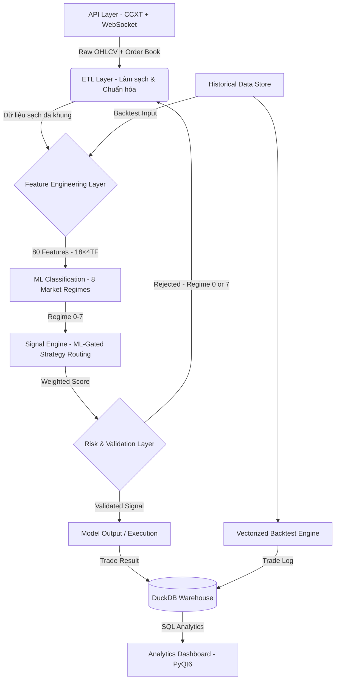

<div align="center">
 


# KAIROS QUANT SYSTEM
### **End-to-End Data Analytics Pipeline for Financial Market Research**

[](https://www.python.org/)
[](https://www.binance.com/)
[](https://opensource.org/licenses/MIT)

`Python` • `Pandas` • `Polars` • `Scikit-Learn` • `PyTorch` • `DuckDB` • `ETL Pipeline` • `Time-Series` • `Feature Engineering`

</div>

<div align="left">
 
-----

### Điểm nổi bật về kỹ năng Phân tích Dữ liệu (Data Skills Highlights)

* **Thiết kế ETL Pipeline tự động:** Thu thập, làm sạch và chuẩn hóa dữ liệu đa nguồn (**Binance, OKX, Bybit**) theo thời gian thực lẫn lịch sử — quy trình hoàn toàn tự động từ Raw API → Clean Dataset.
* **Feature Engineering trên Time-Series quy mô lớn:** Trích xuất 50+ đặc trưng (RSI, ATR, EMA, Bollinger Bands, Volume Profile, Fractal, CVD...) trên 8 khung thời gian đồng thời (**1m–1d**) với kỹ thuật tránh look-ahead bias nghiêm ngặt.
* **Xử lý dữ liệu hiệu suất cao:** Ứng dụng **vectorization** với Pandas/Polars để xử lý hàng triệu dòng dữ liệu, tăng tốc **100x+** so với vòng lặp tuần tự — thực tiễn trực tiếp cho bài toán dữ liệu quy mô lớn.
* **Xây dựng ML Pipeline hoàn chỉnh:** Từ feature extraction, labeling, training (**PyTorch TradingMLP**) đến validation và deployment — phân loại trạng thái thị trường thành 6 nhóm với confidence scoring.
* **SQL Analytics & Data Warehouse (DuckDB):** Toàn bộ kết quả backtest được lưu vào embedded data warehouse. Truy vấn SQL để phân tích winrate theo giờ/ngày, PnL theo ML regime, profit factor, max drawdown — biến trade log thành structured analytical layer.
* **Backtesting như Hypothesis Testing:** Thiết kế framework kiểm định giả thuyết thống kê trên dữ liệu lịch sử — đánh giá chất lượng mô hình, phát hiện overfitting và đo lường tính tổng quát hóa.
* **Interactive Analytics Dashboard:** Xây dựng dashboard phân tích hiệu suất (PyQt6) với Equity Curve, Drawdown Chart, Heatmap theo giờ/ngày, Scatter PnL — biến raw trade log thành actionable insights.

-----

### Minh họa Analytics Dashboard


-----

## Kết quả đạt được (Key Results)

- Xây dựng pipeline xử lý dữ liệu lịch sử **hàng triệu dòng** trên nhiều năm, nhiều cặp tài sản song song
- Tăng tốc phân tích bằng vectorization: từ vài giờ xuống còn vài phút cho cùng khối lượng dữ liệu
- Feature engineering đa khung thời gian không look-ahead bias — điều kiện bắt buộc cho mô phỏng dữ liệu thực
- Data warehouse SQL (DuckDB): mỗi lần chạy backtest được lưu lại, query phân tích winrate/PnL/drawdown theo giờ, thứ, ML regime
- Tự động hóa toàn bộ vòng đời dữ liệu: **Thu thập → Xử lý → Phân tích → Lưu trữ SQL → Trực quan hóa**

## Mục lục (Table of Contents)

1. [Tầm nhìn & Phương pháp luận](#1)
2. [Tổng quan hệ thống](#2)
3. [Kỹ năng & Công nghệ cốt lõi](#3)
4. [Kiến trúc Pipeline Dữ liệu](#4)
5. [Feature Engineering & Hệ thống Chấm điểm Tín hiệu](#5)
6. [ML Pipeline: Phân loại Trạng thái Thị trường](#6)
7. [Analytics Dashboard & Trực quan hóa](#7)
8. [SQL Analytics & Data Warehouse](#8)
9. [Quản trị Rủi ro & Kiểm soát Chất lượng Mô hình](#9)
10. [Cấu trúc thư mục](#10)
11. [Yêu cầu & Hướng dẫn cài đặt](#11)
12. [Hướng dẫn cấu hình](#12)
13. [Lộ trình phát triển](#13)
14. [Chia sẻ của tác giả](#14)
15. [Cảnh báo rủi ro](#15)

-----

<a name="1"></a>

## 1. TẦM NHÌN & PHƯƠNG PHÁP LUẬN

**KAIROS QUANT SYSTEM** là một **Hệ thống Phân tích Dữ liệu end-to-end** ứng dụng vào bài toán nghiên cứu thị trường tài chính — nơi mọi quyết định đều phải được kiểm chứng bằng dữ liệu, không dựa vào trực giác hay cảm tính.

Triết lý xây dựng hệ thống:  
**"Dữ liệu là sự thật duy nhất. Mọi giả thuyết đều phải qua kiểm định thống kê."**

### Bài toán cốt lõi

Thị trường tài chính sinh ra hàng triệu điểm dữ liệu mỗi ngày (OHLCV, order book, funding rate, liquidation...). Thách thức không phải là thiếu dữ liệu — mà là:

1. **Thu thập & chuẩn hóa:** Dữ liệu đến từ nhiều nguồn, nhiều tần suất, nhiều múi giờ → cần pipeline ETL nhất quán.
2. **Feature Engineering:** Từ raw price data → trích xuất tín hiệu có giá trị dự báo (predictive power) mà không bị nhiễu bởi look-ahead bias.
3. **Kiểm định mô hình:** Một chiến lược "hoạt động tốt trên giấy" có thể thất bại trong thực tế nếu thiết kế backtest không nghiêm ngặt — cần framework kiểm định đúng chuẩn.
4. **Ra quyết định tự động dựa trên mô hình:** Kết hợp statistical rules + ML predictions thành một hệ thống điều phối có thể giải thích được (explainable).

### Phương pháp tiếp cận

| Giai đoạn | Phương pháp |
|---|---|
| Thu thập dữ liệu | REST API + WebSocket streaming, đa sàn giao dịch |
| Tiền xử lý | Resampling đa khung, fill NA, timestamp alignment |
| Feature Engineering | 50+ indicators trên 8 timeframes, MTF vectorization |
| Kiểm định | Walk-forward backtest, look-ahead bias prevention |
| Mô hình hóa | Classification (8 market regimes), ResBlock MLP |
| Trực quan hóa | Interactive dashboard: equity curve, heatmap, PnL scatter |

-----

<a name="2"></a>

## 2. TỔNG QUAN HỆ THỐNG

**KAIROS** là một **Data Analytics Pipeline hoàn chỉnh** cho nghiên cứu định lượng thị trường tài chính, bao phủ toàn bộ vòng đời dữ liệu — từ thu thập, xử lý, phân tích, mô hình hóa đến trực quan hóa kết quả.

Hệ thống được thiết kế theo **kiến trúc pipeline modular**, đảm bảo khả năng tái sử dụng, mở rộng và kiểm tra từng thành phần độc lập.

### Các thành phần chính

* **ETL Pipeline:** Tự động kéo dữ liệu đa khung thời gian (1m → 1d) từ API các sàn lớn. Chuẩn hóa, resampling, xử lý gaps và lưu trữ dạng time-series sạch sẵn sàng cho downstream analysis.
* **High-Performance Feature Computation:** Ứng dụng vectorization với Pandas/Polars để tính toán 50+ chỉ báo kỹ thuật (TA features) trên toàn bộ dataset cùng lúc thay vì duyệt từng dòng — xử lý **hàng triệu dòng trong vài phút**.
* **Statistical Signal Engine:** Kết hợp đa tầng phân tích (cấu trúc giá, khối lượng, động lượng, biến động, tâm lý thị trường) thành hệ thống chấm điểm tín hiệu có trọng số, cho phép giải thích được kết quả (interpretable output).
* **Analytics Dashboard:** Ứng dụng Desktop (PyQt6) để phân tích kết quả, so sánh mô hình, khám phá dữ liệu tương tác — không chỉ là biểu đồ giá mà là hệ thống **Performance Analytics** chuyên sâu.

### 7 chế độ vận hành — chọn qua CLI menu

Khởi động bằng `python main.py`, hệ thống hiện menu để chọn chế độ:

| # | Chế độ | Mô tả |
|---|--------|-------|
| 1 | **Giao dịch Realtime** | Kết nối sàn thật, thực thi lệnh qua CCXT |
| 2 | **Demo / Paper Trading** | Pipeline đầy đủ, không đặt lệnh thật |
| 3 | **Backtest Đơn luồng** | Bar-to-bar simulation, 1 CPU thread |
| 4 | **Backtest Đa luồng** | Bar-to-bar parallel, nhiều symbol song song |
| 5 | **Vectorized Backtest** | Matrix operations trên toàn bộ dataset — nhanh hơn 100x |
| 6 | **ML Training** | Huấn luyện/đánh giá/deploy model phân loại regime |
| 7 | **Dashboard Analytics** | Giao diện PyQt6 — equity curve, heatmap, PnL scatter |

-----

<a name="3"></a>

## 3. KỸ NĂNG & CÔNG NGHỆ CỐT LÕI

### Data Engineering & Pipeline

| Kỹ năng | Ứng dụng trong dự án |
|---|---|
| **ETL Design** | Thu thập → validate → transform → store dữ liệu OHLCV từ 3 sàn |
| **Time-Series Processing** | Resampling đa khung, timestamp alignment, fill NA strategy |
| **Data Quality** | Phát hiện gaps, outliers, corrupt candles; look-ahead bias prevention |
| **Performance Optimization** | Vectorization với Polars/Pandas: 100x+ so với loop-based approach |
| **Streaming Data** | WebSocket pipeline: CVD, order book depth, funding rate, liquidation |

### Feature Engineering

| Nhóm Feature | Chỉ báo |
|---|---|
| **Trend** | EMA (9/21/50/200), ADX, Ichimoku Cloud, Supertrend |
| **Momentum** | RSI, MACD, Stochastic, Rate of Change |
| **Volatility** | ATR, Bollinger Bands, Keltner Channel, True Range |
| **Volume** | OBV, Volume Delta (CVD), VWAP, Volume Profile |
| **Price Structure** | Fractal, FVG (Fair Value Gap), ZigZag, Support/Resistance |
| **Sentiment** | Funding Rate, Open Interest, Long/Short Ratio, Fear & Greed |
| **Session** | Asian/London/NY session classification, session range H/L |

### Machine Learning & SQL Analytics

* **Classification Task:** Phân loại thị trường thành **8 trạng thái** (regime 0-7) → routing đến chiến lược phù hợp
* **Architecture:** PyTorch MLP với ResBlock + BatchNorm + Dropout (chống overfitting)
* **Feature Pipeline:** 18 features × 4 timeframes (5M/15M/1H/4H) = **80 features** — Polars-based, không look-ahead bias
* **Evaluation:** Walk-forward validation, confusion matrix, confidence scoring
* **SQL Analytics:** DuckDB embedded warehouse — lưu kết quả từ 5 chế độ vận hành, truy vấn cross-run analysis

### Visualization & Analytics

* **Dashboard:** PyQt6 interactive — equity curve, drawdown, trade scatter, session heatmap
* **Charting:** Candlestick + multi-indicator overlay, entry/exit markers
* **Reporting:** Daily PnL, win rate by hour/day, hold duration distribution

-----

<a name="4"></a>

## 4. KIẾN TRÚC PIPELINE DỮ LIỆU

Hệ thống được phân tách rõ ràng thành các tầng độc lập (Separation of Concerns), dễ test và mở rộng từng module.



**Tầng 1 — Data Acquisition (`/lay_du_lieu`):**  
ETL layer kết nối REST API + WebSocket để kéo dữ liệu OHLCV đa khung, snapshot order book theo thời gian thực, và macro data (Open Interest, Fear & Greed Index). Xử lý gaps, timestamp normalization, và multi-source deduplication.

**Tầng 2 — Feature Engineering (`/chien_luoc/phan_tich_ky_thuat`):**  
Hai nhóm tính toán song song, không look-ahead bias:
- **Signal features** (strategy layer): 50+ technical indicators trên 8 timeframe (1m→1d) — EMA, ADX, RSI, Bollinger, ATR, CVD, Fractal, FVG...
- **ML features** (`/ml/tao_feature.py`): 18 chỉ báo cốt lõi × 4 timeframe (5M/15M/1H/4H) + 8 context = **80 dimensions** dùng riêng cho TradingMLP

Hai engine xử lý:
- `logic_bar_to_bar` — Polars-based, xử lý từng nến mới theo thời gian thực
- `logic_vectorized` — Pandas/NumPy, xử lý toàn bộ dataset theo batch

**Tầng 3 — ML Core (`/ml`):**  
Phân loại thị trường thành 8 regime (0-7): feature extraction (Polars) → normalization → TradingMLP → confidence-weighted regime label. Regime 0 (Đóng_Băng) và 7 (Quét_Thanh_Khoản) bị lọc khỏi giao dịch. Regime 1-6 route sang chiến lược phù hợp.

**Tầng 4 — Signal Engine (`/chien_luoc`):**  
ML regime gating quyết định chiến lược nào được kích hoạt. Mỗi trong 5 chiến lược (Breakout, Squeeze, Trend Following, Mean Reversion, Scalping) chấm điểm độc lập, kết quả được chọn theo regime hiện tại.

**Tầng 5 — Data Warehouse (`/utils/kho_du_lieu.py`):**  
Toàn bộ kết quả từ 5 chế độ vận hành (backtest_bar, backtest_da_luong, backtest_vector, demo, realtime) được lưu vào DuckDB với `run_id` riêng. Truy vấn SQL phân tích cross-run, cross-mode.

**Tầng 6 — Analytics Layer (`/hien_thi`):**  
Dashboard PyQt6 trực quan hóa kết quả: equity curve, drawdown, trade analysis, session heatmap — biến raw trade log thành actionable insights.

-----

<a name="5"></a>

## 5. FEATURE ENGINEERING & HỆ THỐNG CHẤM ĐIỂM TÍN HIỆU

### Thiết kế Feature Engineering không Look-ahead Bias

Đây là thách thức kỹ thuật cốt lõi của toàn bộ dự án. Mọi feature được tính theo kỹ thuật **"anchor + shift"**:

```
1. Resample 1m → HTF candles (e.g. 1h)
2. Tính indicator trên closed HTF candles
3. Shift index forward 1 bar  ← Ngăn look-ahead bias
4. Forward-fill về khung 1m
5. Build live candle (high=cummax, low=cummin, vol=cumsum)
6. Cập nhật indicator trên live candle bằng Wilder's smoothing
```

Phương pháp này đảm bảo tại mỗi thời điểm `t`, model chỉ nhìn thấy dữ liệu đã có trước `t` — điều kiện bắt buộc để kết quả backtest phản ánh thực tế.

### Ensemble Scoring — Hệ thống chấm điểm có trọng số

Thay vì dùng một rule đơn lẻ, KAIROS kết hợp nhiều góc nhìn phân tích độc lập:

**Các nhóm phân tích:**

| Module | Chức năng phân tích | Trọng số điển hình |
|---|---|---|
| `xu_huong.py` | EMA alignment, ADX strength, trend structure | Cao (khung 1h) |
| `cau_truc_gia.py` | Breakout, Fractal, FVG, Support/Resistance | Cao (khung 4h) |
| `khoi_luong.py` | Volume surge, OBV, VWAP deviation | Trung bình |
| `dong_luong_dao_chieu.py` | RSI divergence, MACD, momentum exhaustion | Trung bình |
| `bien_dong.py` | ATR regime, Bollinger squeeze, Keltner | Thấp–Trung bình |
| `vi_the.py` | CVD, Funding Rate, Order Book Imbalance | Xác nhận |
| `chu_ky.py` | Session classification, funding hour filter | Lọc |

**Formula tổng hợp:**
```
Total Score = Σ (Feature_Score_i × Weight_i × Timeframe_Multiplier)
Signal = BUY  nếu Total Score ≥ Threshold
         SELL nếu Total Score ≤ -Threshold
         HOLD otherwise
```

Trọng số thay đổi theo ML regime — khi thị trường được phân loại là "Ranging", trọng số của Mean Reversion feature tăng, Trend feature giảm → mô hình tự thích nghi với điều kiện thị trường.

-----

<a name="6"></a>

## 6. ML PIPELINE: PHÂN LOẠI TRẠNG THÁI THỊ TRƯỜNG

### Bài toán Classification

**Input:** 80 features — 18 chỉ báo × 4 timeframe (5M / 15M / 1H / 4H)  
**Output:** 8 nhãn trạng thái thị trường (multi-class classification)

| Regime | Nhãn | Chiến lược được kích hoạt |
|---|---|---|
| 0 | `Đóng_Băng` | Không trade — thị trường chết |
| 1 | `Nén_Chặt` | Squeeze — chờ bùng nổ |
| 2 | `Đầu_Xu_Hướng` | Breakout — vào sớm theo hướng phá vỡ |
| 3 | `Xu_Hướng_Mạnh` | Trend Following — follow trend đa khung |
| 4 | `Cao_Trào` | Mean Reversion — đánh ngược khi kiệt sức |
| 5 | `Hồi_Quy` | Mean Reversion — về trung bình |
| 6 | `Nhiễu_Động` | Scalping — range trade biên độ hẹp |
| 7 | `Quét_Thanh_Khoản` | Không trade — rủi ro cao |

### Pipeline ML hoàn chỉnh

```
Raw OHLCV (1m)
    ↓ Feature Extraction (Polars, tao_feature.py)
18 features × 4 timeframes = 80 dimensions
    ↓ Labeling (trading_teacher.py)
Labeled Dataset (trading_memory.csv)
    ↓ Preprocessing: normalize, balance classes, train/val split
    ↓ Training: TradingMLP (PyTorch)
        ├── Linear(80→256) + BatchNorm + GELU + Dropout(0.15)
        ├── ResBlock × 3 (256 dim, skip connections, Dropout 0.3)
        └── Linear(256→64) → Linear(64→8) → Softmax (8-class)
    ↓ Evaluation: confusion matrix, walk-forward validation
    ↓ Deployment: model_pytorch.pth + scaler_params.json
    ↓ Inference bar-to-bar: predict 1 nến (~20-35ms, CPU)
    ↓ Inference vectorized: batch predict toàn dataset (~500ms)
```

### Kiến trúc mô hình (TradingMLP)

* **Input:** 80-dim normalized feature vector (18 chỉ báo × 4 timeframe)
* **Hidden layers:** ResBlock stacks với skip connections — giảm vanishing gradient
* **BatchNorm:** chuẩn hóa activation giữa các layer — ổn định training
* **Dropout:** regularization chống overfitting trên dữ liệu time-series
* **Output:** softmax(8) → 8 regime probabilities → confidence-based routing

### Tự động gán nhãn (Auto-labeling)

`trading_teacher.py` tự động phân tích dữ liệu lịch sử và gán nhãn dựa trên bộ quy tắc kỹ thuật:
- Tính toán multi-TF features (EMA alignment, ATR ratio, volume patterns)
- Xác định cấu trúc giá trong cửa sổ `N` nến tiếp theo
- Gán nhãn regime phù hợp → dataset cho supervised learning

-----

<a name="7"></a>

## 7. ANALYTICS DASHBOARD & TRỰC QUAN HÓA

KAIROS tích hợp ứng dụng Desktop (PyQt6) biến kết quả phân tích thành visual insights.

* **Equity Curve & Drawdown Chart:** Đường cong vốn tích lũy + underwater chart — phân tích risk-adjusted performance theo thời gian.
* **Daily PnL Calendar:** Lợi nhuận theo từng ngày dạng calendar view. Click để drill-down từng lệnh cụ thể trong ngày.
* **Session Heatmap:** Ma trận nhiệt Win Rate theo Giờ × Ngày trong tuần — trả lời "lúc nào model hoạt động tốt nhất?".
* **Trade Scatter Plot:** Phân tán Hold Duration × PnL — phát hiện pattern "cắt lời sớm / gồng lỗ" từ data.
* **Signal Quality Dashboard:** Candlestick chart + entry/exit markers + multi-indicator overlay — visualize từng quyết định của model trên price data.


-----

<a name="8"></a>

## 8. SQL ANALYTICS & DATA WAREHOUSE

Sau mỗi lần chạy backtest, toàn bộ lịch sử lệnh được lưu tự động vào **DuckDB** — embedded analytical database chạy trực tiếp trên file, không cần server. Mỗi lần chạy có một `run_id` riêng để so sánh giữa các chiến lược và khoảng thời gian khác nhau.

### Chế độ được ghi nhận

Warehouse tự động nhận dữ liệu từ **tất cả 5 chế độ vận hành**, mỗi lần chạy có `run_id` và `chuc_nang` riêng:

| `chuc_nang` | Nguồn | Cách lưu |
|---|---|---|
| `backtest_bar` | backtest_donluong.py | Batch cuối session |
| `backtest_da_luong` | backtest_daluong.py | Batch ở main process |
| `backtest_vector` | vectorized_backtest.py | Batch cuối session |
| `demo` | chay_demo.py | Streaming từng lệnh |
| `realtime` | chay_realtime.py | Streaming từng lệnh |

### Schema

```sql
-- Metadata mỗi lần chạy
backtest_run (run_id, chuc_nang, ngay_chay, tu_ngay, den_ngay,
              symbols, von_ban_dau, phi_gd, slippage, don_bay)

-- Lịch sử từng lệnh giao dịch
lenh         (run_id, chuc_nang, symbol, loai, chien_luoc,
              regime, regime_name, gia_vao, gia_dong,
              leverage, pnl, thang, thoi_gian, so_du, gio, thu, ngay)
```

### Các câu truy vấn phân tích sẵn

```python
from utils.kho_du_lieu import (
    thong_ke_theo_gio,        # Winrate + PnL theo giờ trong ngày (0–23)
    thong_ke_theo_thu,        # Winrate + PnL theo thứ trong tuần
    thong_ke_theo_regime,     # PnL theo ML regime — regime nào sinh lời nhất?
    thong_ke_theo_chien_luoc, # PnL theo chiến lược (Breakout, Scalping...)
    thong_ke_theo_symbol,     # PnL theo từng cặp tài sản
    thong_ke_theo_mode,       # So sánh kết quả giữa các chế độ vận hành
    thong_ke_tong_quat,       # Summary: winrate, profit factor, drawdown
    max_drawdown,             # Equity curve + underwater chart
    lich_su_run,              # Danh sách tất cả lần chạy
    chay_sql,                 # Ad-hoc SQL query tùy ý
)

# Ví dụ: regime nào có winrate cao nhất?
thong_ke_theo_regime(run_id='20260602_100000_ab12')

# Ví dụ: giờ nào trong ngày bot hoạt động tốt nhất?
thong_ke_theo_gio(run_id='20260602_100000_ab12')

# So sánh bar-to-bar vs vectorized cùng khoảng thời gian
thong_ke_theo_mode()

# Chiến lược nào hiệu quả nhất theo chế độ demo
thong_ke_theo_chien_luoc(chuc_nang='demo')

# Ad-hoc query
chay_sql("""
    SELECT chuc_nang, chien_luoc, ROUND(AVG(pnl), 2) AS tb_pnl, COUNT(*) AS so_lenh
    FROM lenh
    WHERE regime IN (2, 3)
    GROUP BY chuc_nang, chien_luoc
    ORDER BY tb_pnl DESC
""")
```

### Ví dụ output — PnL theo ML regime

| regime | regime_name | so_lenh | winrate_pct | tong_pnl | tb_pnl |
|---|---|---|---|---|---|
| 3 | Xu_Hướng_Mạnh | 142 | 61.3 | +842.5 | +5.9 |
| 2 | Đầu_Xu_Hướng | 98 | 54.1 | +310.2 | +3.2 |
| 6 | Nhiễu_Động | 215 | 44.2 | -180.4 | -0.8 |
| 4 | Cao_Trào | 76 | 48.7 | -42.1 | -0.6 |

Từ bảng này có thể kết luận ngay: tắt scalping ở regime Nhiễu_Động (6) — thứ không ai thấy được nếu chỉ nhìn vào tổng winrate.

-----

<a name="9"></a>

## 9. QUẢN TRỊ RỦI RO & KIỂM SOÁT CHẤT LƯỢNG MÔ HÌNH

Trong phân tích định lượng, kiểm soát rủi ro là yêu cầu bắt buộc — không chỉ về tài chính mà về chất lượng mô hình:

* **Look-ahead Bias Prevention:** Mọi feature đều được tính trước thời điểm tín hiệu. Dữ liệu train/test được chia theo walk-forward (không random shuffle) để phản ánh điều kiện thực tế.
* **Overfitting Detection:** Drawdown limit tự động dừng mô hình khi performance thực tế lệch xa backtest — dấu hiệu của overfitting.
* **Dynamic SL/TP theo ATR:** Stop-loss không cố định theo % tĩnh mà co giãn theo biến động thực tế (ATR) — tránh bị noise quét stop trong thị trường biến động cao.
* **Robustness Testing:** Kiểm thử mô hình trên nhiều cặp tài sản, nhiều giai đoạn thị trường khác nhau (bull/bear/ranging) để đánh giá khả năng tổng quát hóa.

-----

<a name="10"></a>

## 10. CẤU TRÚC THƯ MỤC

```text
Kairos-v2/
├── main.py                              # Entry point – menu điều hướng các chế độ
├── requirements.txt
│
├── config/                              # CẤU HÌNH HỆ THỐNG
│   ├── cau_hinh_giao_dich.yaml          # Assets, khung thời gian, tham số rủi ro
│   ├── cau_hinh_ao_config.json          # Cấu hình môi trường simulation/backtest
│   ├── tai_khoan_api.json               # API credentials (gitignore)
│   ├── tai_khoan_api.json.example       # Template cấu hình API
│   └── thong_tin_san.yaml               # Exchange metadata (min lot, tick size)
│
├── lay_du_lieu/                         # ETL LAYER – Thu thập & Chuẩn hóa Dữ liệu
│   ├── lay_ohlcv.py                     # OHLCV lịch sử + đa khung thời gian (CCXT)
│   ├── lay_marketsnapshot.py            # WebSocket: CVD, order book, liquidation
│   ├── lay_macro.py                     # Macro data: OI, Fear & Greed Index
│   └── lay_thong_tin_tai_khoan.py       # Số dư, vị thế, lịch sử lệnh
│
├── chien_luoc/                          # FEATURE ENGINEERING & SIGNAL LAYER
│   ├── logic_bar_to_bar/                # Engine thời gian thực (Polars, từng nến)
│   │   ├── phan_tich_ky_thuat/
│   │   │   ├── xu_huong.py              # EMA, ADX, Ichimoku, Supertrend
│   │   │   ├── cau_truc_gia.py          # Breakout, Fractal, FVG, ZigZag
│   │   │   ├── khoi_luong.py            # OBV, VWAP, Volume Profile
│   │   │   ├── dong_luong_dao_chieu.py  # RSI, MACD, divergence
│   │   │   ├── bien_dong.py             # ATR, Bollinger, Keltner
│   │   │   ├── vi_the.py                # CVD, Funding Rate, Order Book
│   │   │   └── chu_ky.py                # Session: Asian / London / NY
│   │   ├── chien_luoc/                  # 5 chiến lược (bar-to-bar scoring)
│   │   │   ├── chien_luoc_breakout.py
│   │   │   ├── chien_luoc_squeeze.py
│   │   │   ├── chien_luoc_theo_trend_following.py
│   │   │   ├── chien_luoc_mean_reversion.py
│   │   │   └── chien_luoc_scalping.py
│   │   ├── chien_luoc_trang_thai_thi_truong.py  # Bộ lọc + ML routing
│   │   ├── chien_luoc_don_bay.py        # Đòn bẩy động theo ATR
│   │   ├── stoploss_takeprofit.py       # SL/TP động theo ATR
│   │   └── quan_ly_chien_luoc.py        # Điều phối: ML regime → chiến lược
│   │
│   └── logic_vectorized/                # Engine batch (Pandas, toàn bộ dataset)
│       ├── phan_tich_ky_thuat/          # Cùng 7 module, tính vectorized
│       ├── chien_luoc/                  # 5 chiến lược (vectorized scoring)
│       ├── chien_luoc_trang_thai_thi_truong.py  # Bộ lọc thị trường + ML regime
│       ├── chien_luoc_don_bay.py
│       ├── stoploss_takeprofit.py
│       ├── quan_ly_chien_luoc.py        # Tổng hợp tín hiệu + ML gating
│       └── test_chien_luoc.py           # Unit tests toàn bộ pipeline
│
├── ml/                                  # ML PIPELINE
│   ├── main.py                          # Orchestrator: train / evaluate / deploy
│   ├── nghien_cuu_regime.py             # Notebook-style regime research
│   ├── tool/
│   │   ├── trading_teacher.py           # Auto-labeling: gán nhãn regime tự động
│   │   ├── data_filter.py               # Preprocessing: noise filter, class balance
│   │   ├── dashboard.py                 # Dashboard phân tích chất lượng model
│   │   └── regime_tren_ui.py            # Visualize regime trên biểu đồ giá
│   └── trang_thai_thi_truong_ml/
│       ├── tao_feature.py               # Feature extraction (Polars, 18×4 TF = 80 features)
│       ├── ml_model.py                  # TradingMLP: ResBlock + BatchNorm + Dropout
│       ├── ml_predict.py                # Inference bar-to-bar & vectorized batch
│       ├── ml_deploy.py                 # Export & deploy model artifacts
│       ├── ml_compare.py                # Model versioning & performance comparison
│       └── du_lieu_ml/                  # Model artifacts & training data
│           ├── model_pytorch.pth        # Trained weights
│           ├── scaler_params.json       # Feature normalization parameters
│           └── trading_memory.csv       # Labeled training dataset
│
├── chuc_nang/                           # PIPELINE RUNNERS
│   ├── chay_realtime.py                 # Chạy bot thật (live trading)
│   ├── chay_demo.py                     # Forward test không rủi ro
│   ├── backtest_donluong.py             # Bar-to-bar backtest (1 luồng)
│   ├── backtest_daluong.py              # Bar-to-bar backtest (đa luồng)
│   └── vectorized_backtest.py           # Vectorized backtest toàn dataset
│
├── thuc_thi_lenh/                       # ORDER EXECUTION LAYER
│   ├── bo_may_thuc_thi.py               # Singleton quản lý kết nối sàn
│   ├── chon_san_giao_dich.py            # Factory: chọn sàn theo config
│   ├── mo_lenh.py                       # Mở lệnh đơn sàn
│   ├── mo_lenh_da_san.py                # Mở lệnh đa sàn song song
│   ├── dong_lenh.py                     # Đóng lệnh (market/limit)
│   ├── quan_ly_lenh.py                  # Quản lý trạng thái lệnh đang mở
│   ├── theo_doi_lenh.py                 # Theo dõi SL/TP, trailing stop
│   ├── quan_ly_danh_muc.py              # Portfolio: phân bổ vốn đa tài sản
│   └── ket_noi_san/
│       ├── binance_api.py
│       ├── bybit_api.py
│       └── okx_api.py
│
├── hien_thi/                            # ANALYTICS DASHBOARD (PyQt6)
│   ├── dashboard_backtest.py            # Equity curve, drawdown, PnL scatter
│   ├── dashboard_vectorized.py          # Signal visualization trên biểu đồ nến
│   ├── dashboard_realtime.py            # Live monitoring
│   └── dashboard_demo.py                # Forward-test performance tracking
│
├── thong_bao/                           # NOTIFICATIONS
│   ├── gui_email.py                     # Gửi báo cáo qua Email
│   └── gui_telegram.py                  # Cảnh báo real-time qua Telegram
│
├── utils/                               # UTILITIES
│   ├── ham_tien_ich.py                  # MTF data merge, build_htf_candle
│   ├── doc_cau_hinh.py                  # YAML/JSON config parser
│   ├── log.py                           # Structured logging
│   ├── thoi_gian.py                     # Timestamp handling, timezone
│   ├── chuyen_doi_don_vi.py             # Unit conversion (lot, pip, USDT)
│   ├── save_dataflie.py                 # Lưu kết quả backtest ra CSV/JSON
│   └── kho_du_lieu.py                   # Data Warehouse (DuckDB): lưu & SQL analytics
│
└── du_lieu/                             # DATA STORAGE
    ├── lich_su_gia/                     # Historical OHLCV (CSV)
    ├── du_lieu_vectorized/              # Kết quả vectorized backtest
    ├── thong_tin_lenh/                  # Trade logs, trạng thái lệnh
    ├── thong_tin_tai_khoan/             # Snapshot số dư, vị thế
    ├── kairos_warehouse.duckdb          # Data warehouse – toàn bộ lịch sử backtest
    └── nhat_ky_hoat_dong.log            # Application log
```

-----

<a name="11"></a>

## 11. YÊU CẦU & HƯỚNG DẪN CÀI ĐẶT

```bash
# Clone và cài đặt dependencies
git clone <repo>
cd kairos-v2
pip install -r requirements.txt
```

**Thư viện chính:**

| Thư viện | Mục đích |
|---|---|
| `pandas`, `polars` | Data processing & feature engineering |
| `numpy` | Vectorized computations |
| `pytorch` | ML model training & inference |
| `scikit-learn`, `joblib` | ML preprocessing, metrics |
| `ta` | Technical analysis indicators (RSI, ATR, ADX...) |
| `ccxt` | Exchange API connector — Binance, OKX, Bybit |
| `requests` | HTTP client cho REST API |
| `PyYAML` | Đọc file cấu hình YAML |
| `pyqt6` | Analytics dashboard UI |
| `pyqtgraph`, `matplotlib` | Charting & visualization |
| `websocket-client` | Streaming data pipeline |
| `duckdb` | Embedded SQL analytics — data warehouse cho kết quả backtest |
| `pyarrow` | Columnar I/O, cầu nối Polars ↔ Pandas |
| `rich` | Structured terminal logging |
| `pytest` | Unit testing |

-----

<a name="12"></a>

## 12. HƯỚNG DẪN CẤU HÌNH

### 12.1 Cấu hình phân tích (YAML)

Thiết lập file `config/cau_hinh_giao_dich.yaml` — định nghĩa nguồn dữ liệu và tham số cho pipeline:

```yaml
san_giao_dich_chinh: "binance"   # Data source: binance / okx / bybit
cap_giao_dich:                   # Danh sách assets cần phân tích
  - "BTC/USDT"
  - "ETH/USDT"
  - "SOL/USDT"

# Tham số simulation & risk model
von_moi_lenh_usdt: 100           # Capital allocation per signal ($)
don_bay: 7                       # Leverage multiplier (futures sim)
max_lenh_cho_phep: 20            # Max concurrent positions
cat_lo_percent: 0.1              # Stop-loss threshold (10%)
chot_loi_percent: 0.15           # Take-profit threshold (15%)
```

### 12.2 Khởi chạy

```bash
python main.py
```

Hệ thống hiện CLI menu, nhập số để chọn chế độ:

```
╔══════════════════════════════════════════════════════╗
║            KAIROS QUANT SYSTEM  v2                  ║
╠══════════════════════════════════════════════════════╣
║                                                      ║
║   [1]  Giao dich Realtime      (live trading)        ║
║   [2]  Demo / Paper Trading    (khong rui ro)        ║
║                                                      ║
║   [3]  Backtest Don luong      (bar-to-bar)          ║
║   [4]  Backtest Da luong       (bar-to-bar parallel) ║
║   [5]  Vectorized Backtest     (toan bo dataset)     ║
║                                                      ║
║   [6]  ML Training             (huan luyen model)    ║
║                                                      ║
║   [7]  Dashboard Analytics     (GUI PyQt6)           ║
║                                                      ║
║   [0]  Thoat                                         ║
╚══════════════════════════════════════════════════════╝

Chon chuc nang [0-7]:
```

Import lazy — chỉ load thư viện cần thiết cho chế độ được chọn. PyQt6 không được import khi chạy backtest CLI.

-----

<a name="13"></a>

## 13. LỘ TRÌNH PHÁT TRIỂN

* **Alternative Data Integration:** Tích hợp NLP sentiment từ social media, on-chain data, macro economic indicators làm features bổ sung cho ML pipeline.
* **Reinforcement Learning:** Nâng cấp auto-labeling thành RL agent tự tối ưu strategy parameters thông qua simulation.
* **Portfolio Optimization:** Phân bổ vốn đa tài sản dựa trên correlation matrix và mean-variance optimization.
* **Options Analytics:** Mở rộng sang phân tích implied volatility, Greeks, và options flow.
* **Performance:** Hybrid Python/Rust cho computation-heavy features, giảm latency pipeline.

-----

<a name="14"></a>

## 14. CHIA SẺ CỦA TÁC GIẢ

Tôi bắt đầu Kairos như nhiều dự án quant khác: tin rằng nếu kết hợp đủ nhiều chỉ báo kỹ thuật với machine learning, hệ thống sẽ tự tìm ra edge trong thị trường. Cứ thêm một indicator, thêm một khung thời gian, thêm một lớp ML là mọi thứ sẽ hội tụ về kết quả tốt hơn.

Sau một thời gian xây dựng, tôi nhận ra điều mà cộng đồng quant hay gọi là "the fundamental problem": toàn bộ OHLCV là thông tin công khai, đã được hàng triệu người tham gia thị trường phản ánh vào giá. Một mô hình phân loại trạng thái thị trường từ nến giá không tạo ra thông tin mới — nó chỉ là cách mô tả đẹp hơn về những gì đã xảy ra. Không có edge thực sự ở đó, dù pipeline có tinh vi đến đâu.

Điều này không có nghĩa là dự án vô ích. Quá trình xây dựng Kairos cho tôi hiểu sâu hơn về feature engineering time-series, look-ahead bias, kiến trúc pipeline cho dữ liệu tài chính quy mô lớn — những thứ có giá trị độc lập với việc hệ thống có sinh lời hay không. Tôi cũng hiểu rõ hơn tại sao hầu hết các backtesting framework thương mại đều overfitting: chúng dùng đúng một loại dữ liệu mà thị trường đã định giá xong.

Hướng tôi nghĩ dự án cần đi tiếp là thêm các nguồn dữ liệu có informational edge thực sự: order flow real-time, on-chain metrics (exchange inflow/outflow), cross-asset correlation (DXY, OI, funding rate tổng hợp nhiều sàn). Khi ML có thêm thứ gì đó phi hiển nhiên để học — thứ mà không phải ai cũng thấy được ngay trên biểu đồ — lúc đó nó mới có thể tạo ra giá trị thay vì chỉ phân loại những gì technical analysis đã biết từ lâu.

Kairos v2 là nền tảng kỹ thuật để làm được điều đó. Pipeline đã đúng. Vấn đề là dữ liệu đầu vào.

-----

<a name="15"></a>

## 15. CẢNH BÁO RỦI RO

**Lưu ý quan trọng:**

1. Kết quả backtest dựa trên dữ liệu lịch sử **không đảm bảo hiệu suất tương lai**. Mô hình thống kê chỉ đo lường xác suất — không dự báo chính xác tuyệt đối.
2. Hệ thống phục vụ mục đích **nghiên cứu và phân tích định lượng**. Người dùng chịu hoàn toàn trách nhiệm cho các quyết định dựa trên output của hệ thống.
3. Thị trường Cryptocurrency có biến động cực cao — rủi ro mất vốn là thực.

-----

**Về mã nguồn:**  
Repository này là bản nền tảng mang tính Proof-of-Concept về kiến trúc pipeline và phương pháp luận phân tích. Các module nâng cao và phiên bản production được giữ Closed-source.

-----

### THÔNG TIN TÁC GIẢ

* **Vai trò:** Data Analyst · Quant Researcher
* **Stack:** Python · Pandas · Polars · PyTorch · DuckDB · PyQt6 · CCXT
* **Phương pháp:** Data-driven design · Statistical validation · Human logic + AI-assisted development
* **Contact:** ppvinh1513@gmail.com

*"Romain Rolland: 'There is only one heroism in the world: to see the world as it is, and to love it.'"*

</div>
